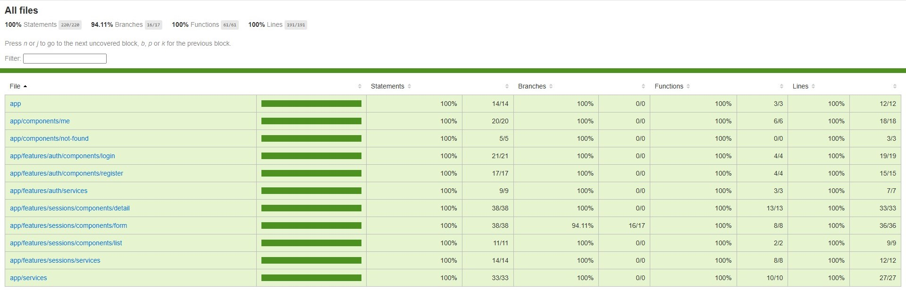
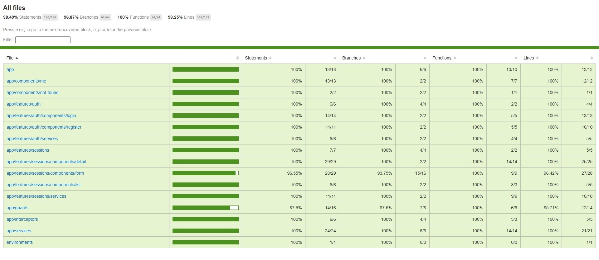
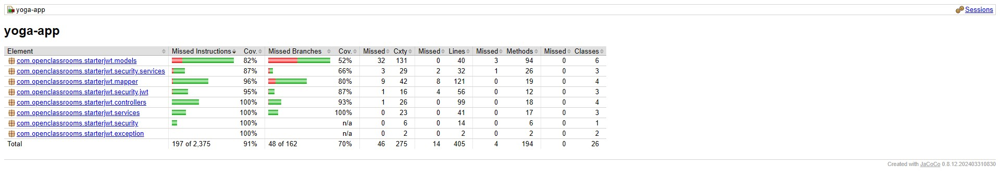

<a name="readme-top"></a>

<!-- PROJECT SHIELDS -->
<!--
*** I'm using markdown "reference style" links for readability.
*** Reference links are enclosed in brackets [ ] instead of parentheses ( ).
*** See the bottom of this document for the declaration of the reference variables
*** for contributors-url, forks-url, etc. This is an optional, concise syntax you may use.
*** https://www.markdownguide.org/basic-syntax/#reference-style-links
-->

<h3 align="center">Yoga</h3>

<p align="center">
School work : Testing a basic platform which allows users to book yoga sessions. A 80% coverage was expected.
</p>

Here are my coverage reports.

- Jest (Frontend) :



- Cypress (E2E) :



- Jacoco (Backend) :



<!-- TABLE OF CONTENTS -->
<details>
  <summary>Table of Contents</summary>
  <ol>
    <li>
      <a href="#about-the-project">About The Project</a>
      <ul>
        <li><a href="#built-with">Built With</a></li>
      </ul>
    </li>
    <li>
      <a href="#getting-started">Getting Started</a>
      <ul>
        <li><a href="#prerequisites">Prerequisites</a></li>
        <li><a href="#frontend-installation">Frontend Installation</a></li>
        <li><a href="#backend-installation">Backend Installation</a></li>
      </ul>
    </li>
    <li><a href="#usages">Usages</a></li>
    <li><a href="#swagger">Swagger</a></li>
  </ol>
</details>

<!-- ABOUT THE PROJECT -->

## About The Project

Testing a basic platform allowing individuals to book yoga sessions. A 80% coverage was expected.

### Built With

- Spring Boot
- Spring Security
- Lombok Annotations
- MySQL
- Spring JPA
- Jakarta Validation

<p align="right">(<a href="#readme-top">back to top</a>)</p>

<!-- GETTING STARTED -->

## Getting Started

To run the app, you will need to clone the following repository :

- Repository :

  ```
  git clone https://github.com/ask0ldd/SpringAngularTesting.git
  ```

### Prerequisites

First you need to install these softwares, packages and librairies :

- nodejs
  ```
  https://nodejs.org/en
  ```
- npm (after installing nodejs)
  ```
  npm install -g npm
  ```
- java development kit 17 (jdk17) and if needed, add a JAVA_HOME environment variable pointing at your java installation folder.
  ```
  https://www.oracle.com/java/technologies/javase/jdk17-archive-downloads.html
  ```
- maven
  ```
  https://maven.apache.org/download.cgi
  https://maven.apache.org/install.html
  ```
- mysql & mysqlwork bench (full install)

  ```
  https://dev.mysql.com/downloads/windows/
  ```

- the angular cli (after installing nodejs)
  ```
  npm install -g @angular/cli
  ```


<p align="right">(<a href="#readme-top">back to top</a>)</p>

### Running the Frontend

1. Get into the front folder of the project

2. Install the packages needed for the front end (node & npm should be installed first)
   ```
   npm install
   ```
3. Start the Front End of the App (npm & the angular cli should be installed first)
   ```
   npm run start
   ```

<p align="right">(<a href="#readme-top">back to top</a>)</p>

### Backend Installation

1. Get into the back folder of the project

2. Install MySQL & Workbench and define a root password.

3. Get into the resources folder of the project and edit the following lines of the application.properties file, with your root password replacing 'yourownrootpassword' (don't do this on a production server, create a new user with all the needed authorisations instead) :
   ```
   spring.datasource.username=root
   spring.datasource.password=yourownrootpassword
   ```
4. Open MySQL Workbench
   ```
   The following connection should already be set up :
      Local Instance MySQL80 / user : root / url : localhost:3306.
   ```
5. Create an empty "test" schema with MYSQL Workbench. You don't need to do more than that since all the mandatory tables will be created by Spring JPA when executing the project.

6. Build the project.

   ```
   mvnw package
   ```

7. Run the project with Maven.
   ```
   mvnw spring-boot:run
   ```

<p align="right">(<a href="#readme-top">back to top</a>)</p>

<!-- USAGE EXAMPLES -->

## Usages

- Register a new user account.
- Log into your account.
- View the user's information.
- Post a new yoga session.
- Update an existing session.
- Browse all posted sessions.
- View all the details regarding a specific session.
- Delete a session.
- Subscribe / Unsubscribe from a session.

<p align="right">(<a href="#readme-top">back to top</a>)</p>

<!-- TESTING -->

## Jest Unit & Integration Frontend Testing

Install the frontend first.

- Running the tests : 
   ```
   npm run test
   ```
- Generating the coverage, execute :
   ```
   npm run coverage
   ```
- To access the generated coverage :
   ```
   visit /front/coverage/jest/lcov-report/index.html
   ```

## Cypress E2E Testing

Install the frontend first.

- Go to the Front folder then run :
   ```
   npm run e2e
   ```
- Choose Chrome as your test browser.


- NB : Cypress has some inconsistent behavior so you may have to execute the tests two times if some of them are failing. 


- To generate the coverage, execute : 
   ```
   npm run e2e:coverage
   ```
- To access the generated coverage :
   ```
   visit /front/coverage/lcov-report/index.html
   ```

## Junit Unit & Integration Testing

Install the backend first.

To train myself, I have written almost 200 tests so it may take around 20 minutes to execute them all. Please be patient.

- Go to the /back/ folder.
   

- To generate the coverage, execute :
   ```
   mvn clean test
   ```
- To access the generated coverage :
   ```
   visit /back/target/site/jacoco/index.html
   ```

<p align="right">(<a href="#readme-top">back to top</a>)</p>